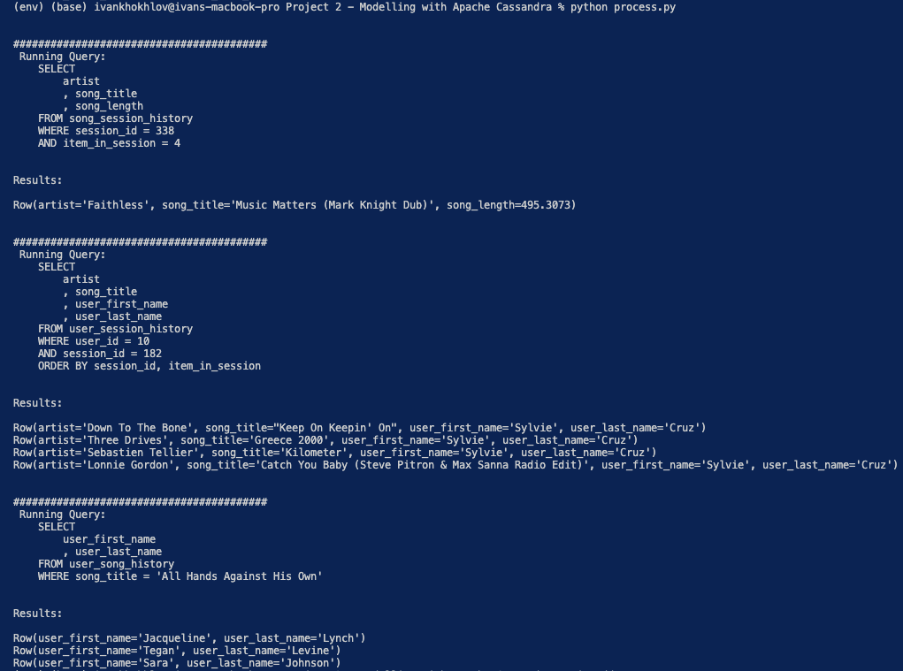

# Project: Cassandra Data Modelling

This project was completed on 20th June 2021.

## Introduction

Unprocessed data for music listening history has been provided along with requirements to generate 3 queries for analysis purposes.

This project aims to:
1. Convert the raw events data spread across multiple files into a single file with prepared data for processing.
2. Model a cassandra database with 3 tables to match the query requirements.
3. Process the data and load it into the tables.
4. Run queries to ensure data has been loaded correctly.

## Quick Start Guide

1. Ensure Python 3.6+ is installed
2. Clone the repo: ```https://github.com/aivoric/Data-Engineering-ND-Modelling-Cassandra-Project-2```
3. Enter the downloaded folder and create a virtual environment: ```python3 -m venv env``` and then activate it.
4. Install dependencies: ```pip install -r requirements.txt```

The next steps assume you have Cassndra up and running with the following defaults:
```"host=127.0.0.1"```

5. Run prepare.py to generate the event_datafile_new.csv which will contain cleaned data ready for processing.
6. Run process.py which will create the database, tables, insert the data into the tables, then query the data, and finally drop the tables.

## Setting Up Cassandra Locally

Cassandra can be tricky tp setup locally. Here are a few useful links to help you do it.

**Installing Cassandra:**
[https://youtu.be/7QCQaZzCblg](https://youtu.be/7QCQaZzCblg)

**Download stable release:**
[https://cassandra.apache.org/download/](https://cassandra.apache.org/download/)

**Download Java 8 (Cassandra requires it):**
[https://www.oracle.com/java/technologies/javase/javase-jdk8-downloads.html](https://www.oracle.com/java/technologies/javase/javase-jdk8-downloads.html)

**Downgrade to Java 8 (Incase you have a higher Java version, as Cassandra requires a lower Java version):**
[https://stackoverflow.com/questions/46513639/how-to-downgrade-java-from-9-to-8-on-a-macos-eclipse-is-not-running-with-java-9](https://stackoverflow.com/questions/46513639/how-to-downgrade-java-from-9-to-8-on-a-macos-eclipse-is-not-running-with-java-9)


## Notes on Files

```cql_queries.py``` contains all the SQL statements for creating, inserting, selecting, dropping data for 3 tables. In addition it also contains script for creating the database if it didn't exist. Tables created:
* song_session_history
* user_session_history
* user_song_history 

```prepare.py``` contains the logic to process all the event data stored across various csv files in /event_data into a single file.

```process.py``` contains the logic for creating the necessary cassandra tables, processing the newly created csv file, and checking that everything has been written to Cassandra correctly.


## Database Design

The database contains 3 tables which have been optimised for retrieving data for 3 queries.

1. Give me the artist, song title and song's length in the music app history that was heard during sessionId = 338, and itemInSession = 4

```
CREATE TABLE IF NOT EXISTS song_session_history (
        session_id int
        , item_in_session int
        , artist text
        , song_title text
        , song_length double
    , PRIMARY KEY (session_id, item_in_session))
```

session_id and item_in_session are used as primary key and clustering columns because we have a WHERE statement which groups data by those fields. It also ensures every row is correctly unique.


2. Give me only the following: name of artist, song (sorted by itemInSession) and user (first and last name) for userid = 10, sessionid = 182

```
    CREATE TABLE IF NOT EXISTS user_session_history (
        user_id int
        , session_id int
        , item_in_session int
        , artist text
        , song_title text
        , user_first_name text
        , user_last_name text
    , PRIMARY KEY (user_id, session_id, item_in_session))
```

user_id, session_id, and item_in_session are used as primary key and clustering columns because we have a WHERE statement which groups data by the user_id and session_id columns and we also need to sort by the item_in_session column.

3. Give me every user name (first and last) in my music app history who listened to the song 'All Hands Against His Own'

```
    CREATE TABLE IF NOT EXISTS user_song_history (
        song_title text
        , user_id int
        , user_first_name text
        , user_last_name text
    , PRIMARY KEY (song_title, user_id))
```

song_title and user_id are used as primary key and clustering columns because this gives us a unique combination of all the songs listened by every individual user. Since we are also using song_title in the WHERE statement then this our perfect partioning key.

## Expected Results

